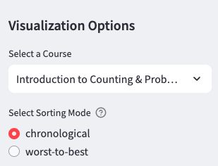
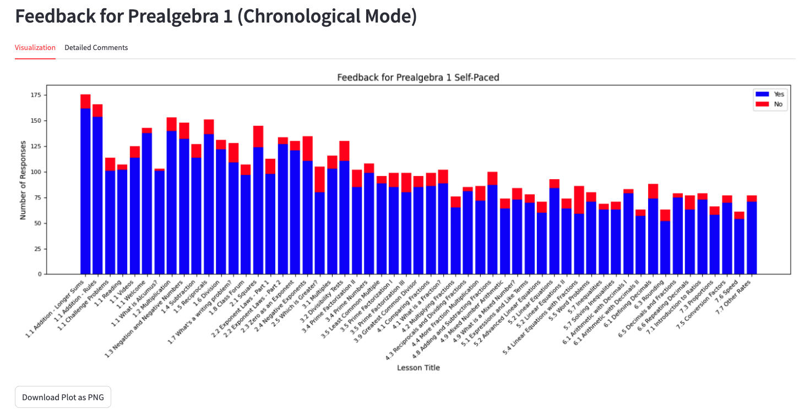
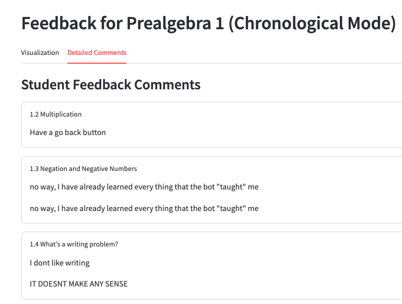
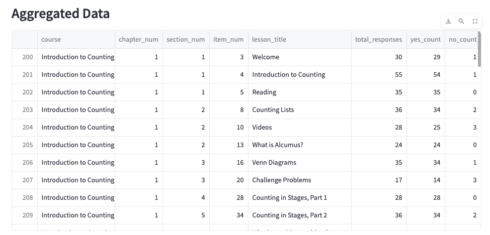

# Self-Paced Feedback Visualization

This repository contains a pipeline to scrape, parse, aggregate, and visualize student feedback from an internal webpage. You can:

- Choose your course:  
  

- Visualize feedback:  
  

- Read student comments:  
  

- Download the data in a table:  
  


Hooray!

## Installation & Setup

We recommend using a virtual environment for dependency isolation. You can set up your environment manually or use our provided Makefile to automate the process. If you use the Makefile, it supports only Python 3.10. If you use the manual setup, we have tested with Python 3.10 and 3.11.

### Manual Setup

1. **Clone the Repository:**
```bash
   git clone git@github.com:adjones-aops/sp-feedback.git && cd sp-feedback
```

2. **Create a Virtual Environment:**
```bash
   python3.10 -m venv env
```

3. **Activate the Virtual Environment:**
   - On macOS/Linux:
```bash
     source env/bin/activate
```

   - On Windows:
```
     env\Scripts\activate
```

4. **Install Dependencies:**
```bash
   pip install --upgrade pip
   pip install -r requirements.txt
   pip install --editable .
```

### Automated Setup Using Makefile

If you have GNU Make installed, you can simplify the process by running:
```bash
   make setup
```

## Usage

### Running the Pipeline via Streamlit

After setting up the environment, launch the Streamlit app from the root directory by running:
```bash
   streamlit run streamlit_app/app.py
```

or, if you set up the Makefile, run:
```bash
   make run    
```

This interactive app allows you to:

- **Scrape & Update Data:**  
  Click the **Scrape & Update Data** button to initiate the backend pipeline. This will open a Selenium browser for manual login and MFA, then save the scraped HTML, parse it, and aggregate the data.
  For future times you run the app, you won't have to do a manual login and MFA unless you want to scrape new data.

- **Visualization Options:**  
  Select a course and sorting mode (Chronological or Worst-to-Best) from the sidebar. The app then displays:
  - A bar chart of feedback.
  - A download button for the chart.
  - A tabbed view with:
    - **Visualization:** The feedback bar chart.
    - **Detailed Comments:** Expandable sections for student feedback, with multiple responses for a lesson shown on separate lines.

### Running Tests

To run the complete test suite, from the root directory, run:
```bash
   pytest
```

## Development & CI

- The project uses GitHub Actions for continuous integration. See .github/workflows/ci.yml for details.
- Extend the tests in the tests/ directory if you add new functionality.

## Contributing

Contributions are welcome! Please open issues or submit pull requests for any bug fixes or feature improvements.

## License

[MIT License](LICENSE)
